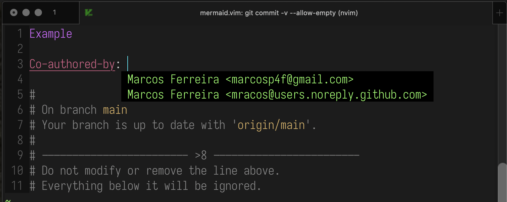

Co-authored-by (git authors*) completion source for [asyncomplete.vim](https://github.com/prabirshrestha/asyncomplete.vim)

> * Lists people that have commited to the current repository in the `Name <email@example.org>` format



:warning: &nbsp; Not used anymore since I started using [nvim-compe](https://github.com/hrsh7th/nvim-compe) :warning:

### Install

Using `vim-plug`

```vim
Plug 'prabirshrestha/asyncomplete.vim'
Plug 'mracos/asyncomplete-co-authored-by.vim'
```

### Register asyncomplete-co-authored-by.vim
```vim
autocmd User asyncomplete_setup
      \ call asyncomplete#register_source({
        \ 'name': 'co-authored-by',
        \ 'whitelist': ['gitcommit'],
        \ 'completor': function('asyncomplete#sources#co_authored_by#completor')
      \ })
augroup END
```

### Trigger

It autocompletes authors on the `Co-authored-by: ` trigger, more info about this magical string [here](https://docs.github.com/en/github/committing-changes-to-your-project/creating-and-editing-commits/creating-a-commit-with-multiple-authors)
## Contributing

Please do! Just send a Pull Request and I'll try to see it in due time. :smile:

As of, it's just enough so that it works for me, there is lots of TODOs across the code and its still missing some testing but that's on you, [don't let your dreams be dreams](https://www.youtube.com/watch?v=ZXsQAXx_ao0)

## License

MIT, see [LICENSE](./LICENSE) for more details.
